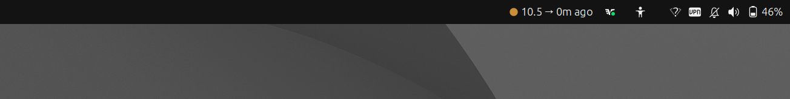
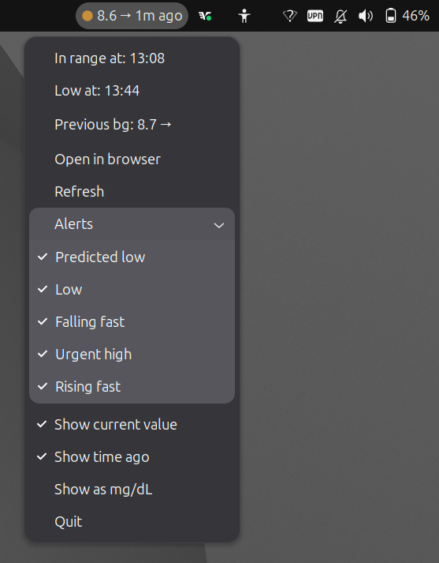

# nightscout-go-systray



A Linux system tray app to display live Nightscout CGM data.

## Requirements

- A Linux desktop (Ubuntu 22.04 or newer recommended)
- A running [Nightscout](https://nightscout.github.io/) instance 
> Guide for self hosted nightscout instance on a vps using docker container and nginx proxy manager here:
> [github.com/harmen91/nightscout-docker-simple](https://github.com/harmen91/nightscout-docker-simple)

## 1. Install Go and system dependencies

- Go 1.25+ — `sudo snap install go --classic`
- `sudo apt install libayatana-appindicator3-dev`

## 2. Build the app

```bash
git clone https://github.com/harmen91/nightscout-go-systray
cd nightscout-go-systray
go get -u ./...
go build .
mkdir -p ~/.local/bin
cp cgm ~/.local/bin/
```

## 2.1 Ensure the binary exists and has execute permissions:

```bash
ls -la ~/.local/bin/cgm
chmod +x ~/.local/bin/cgm
```

## 3. Run the app

Example:

```bash
cgm -url https://your-nightscout-url.com
```

Usage of cgm:

```
  -url string
        Your nightscout url e.g. https://example.herokuapp.com
  -high float
        Your BG high target (default 8)
  -low float
        Your BG low target (default 4)
  -urgent-high float
        Your BG urgent high target (default 15)
```

> **Note:** If `cgm` is not found, reload your shell first: `source ~/.bashrc` (or open a new terminal)

## 4. Run automatically on login

To have the app start in the background without a terminal:
Create a cgm.desktop file at ~/.config/autostart

```bash
mkdir -p ~/.config/autostart
nano ~/.config/autostart/cgm.desktop
```

Change username and https://your-nightscout-url.com accordingly

```ini
[Desktop Entry]
Type=Application
Name=Nightscout CGM
Exec=/home/username/.local/bin/cgm -url https://your-nightscout-url.com
Terminal=false
```

## Appendix: Screenshot

